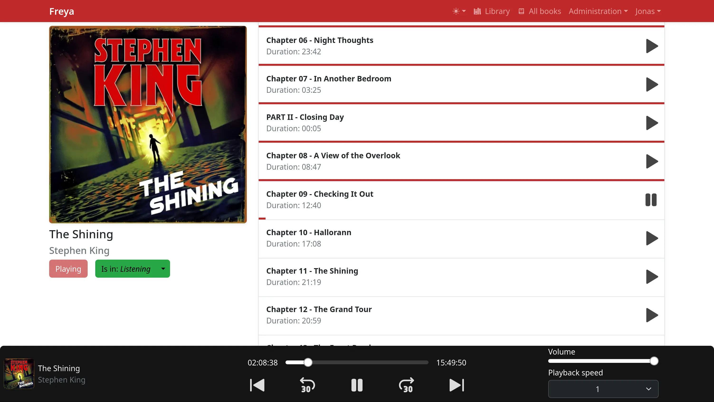

# Freya - Audiobook server



A server to easily host and listen to audiobooks.

There is a good chance you would be more happy with [Audiobookshelf](https://github.com/advplyr/audiobookshelf).
Freya is much more limited in scope and relies heavily on the browser to provide the necessary
codecs and features to play audio. Audiobookshelf is a much more complete solution and is much more
likely to be what you are looking for.

## Features

- Web interface to listen to audiobooks
  - Doesn't provide a way to get audiobooks onto the server
- Keeps track of the last played position
- Multiple users
- Dark mode
- Mobile friendly-ish (not a PWA, minimal Safari support)

## Build

There is a Dockerfile available to build the project in a container. This is the recommended way to
build the project.

To manually build the project:

1. You will need the following dependencies to build (but not run) the project:

   - [Node.js](https://nodejs.org/en/) (tested with `v21.6.1`)
   - [Rust](https://www.rust-lang.org/tools/install) (tested with `rustc 1.76.0 (07dca489a 2024-02-04)`)

2. Clone the repository and navigate to the project directory.

3. Run the following command to build:

   ```bash
   cargo build --release
   ```

   This should install all the required dependencies and build both the frontend and backend.

The built binary will be located at `./target/release/freya`. It contains both the server and
frontend.

## Run

1. To run the project, you will need the following dependencies:

   - [FFmpeg](https://ffmpeg.org/download.html) (tested with `n6.1.1`)

2. Set the following environment variables:
   - `DATABASE_PATH`: The path to the database, e.g. `sqlite://db`. (default: `./freya.db`)
   - `NO_MIGRATE`: Set to not run migrations on startup. (default: `false`)
   - `PORT`: The port to run the server on. (default: `3000`)
   - `SESSION_LIFETIME`: The lifetime of a session in hours. (default: `720` which equates to 30 days)
   - `DEFAULT_DIRECTORY`: The path that the file select dialog will open to. (default: `C:\` on Windows, `/` on Unix)

This can either be done by creating a `.env` file in the root of the project or by setting the
environment variables manually.

3. Then simply run the binary you built. The frontend is bundled into the binary and will be served
   unless the client hits an API endpoint.

## License

Freya is licensed under the [ISC License](./LICENSE).
